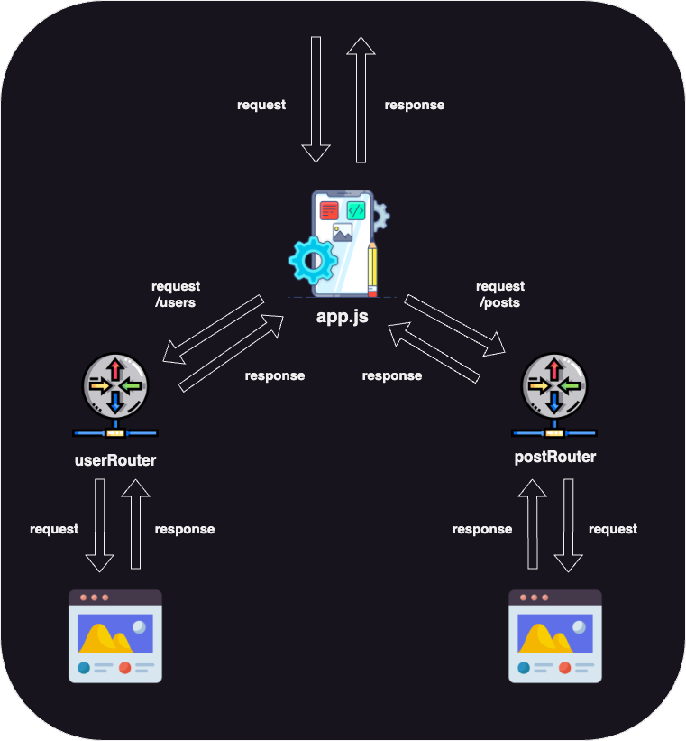

## 🚀 Intro
---
```
커뮤니티 서비스를 위한 프론트엔드 서버 프로젝트입니다.
```

<br>

##### Demo

__[🔗 커뮤니티 서비스 데모 영상](https://youtu.be/JTaqMh2IlZ8)__


<br>


##### Servers

__[🔗 Backend Server - Express](https://github.com/100-hours-a-week/5-ian-jeong-community-backend-express)__
__[🔗 Frontend Server - React](https://github.com/100-hours-a-week/5-ian-jeong-community-front-react)__

<br>

##### Tech Stacks

[](https://developer.mozilla.org/en-US/docs/Web/JavaScript) 


##### Dev Env

[](https://www.apple.com/macos/big-sur/) [](https://code.visualstudio.com/)


<br><br><br><br><br>

## 🗂️ Directory Structure
---

```javascript
community-frontend-vanilla
|
| --- app.js  // express 앱의 진입점
| --- routes
|        |
|        | --- userRouter.js  // 유저 관련 페이지 라우터
|        | --- postRouter.js  // 게시글 관련 페이지 라우터
|
| --- view  // 응답으로 사용할 html 
|        | 
|        | --- index.html
|        | --- sign-in.html
|        | --- sign-up.html
|        | --- posts.html
|        | --- add-post.html
|        | --- post-detail.html
|        | --- edit-post.html
|        | --- edit-user.html
|        | --- edit-password.html
|
| --- public
         |
         | --- css  // 응답 페이지의 css
         |      |
         |      | --- index.css
         |      | --- sign-in.css
         |      | --- sign-up.css
         |      | --- posts.css
         |      | --- add-post.css
         |      | --- post-detail.css
         |      | --- edit-post.css
         |      | --- edit-user.css
         |      | --- edit-password.css
         |
         | --- javascript  
         |      |
         |      | --- globals.js  // 백엔드와 프론트엔드의 IP, port 번호를 전역으로 관리하기 위해 작성 (모듈로 로드하고 localStorage에 저장)
         |      | --- fireworks.js  // 배경 클릭 폭죽 이벤트
         |      | --- sign-in.js
         |      | --- sign-up.js
         |      | --- posts.js
         |      | --- add-post.js
         |      | --- post-detail.js
         |      | --- edit-post.js
         |      | --- edit-user.js
         |      | --- edit-password.js

```


<br><br><br><br><br>

## 🏯 Architecture
---




<br><br>

```
백엔드와 비슷한 형태를 가지지만 프론트엔드 서버는 데이터에 대한 비즈니스 로직을 수행하지 않습니다.
응답데이터는 요청 URL에 따른 해당 페이지입니다.
```


<br>

#### ✅ Request & Response
```
요청 & 응답의 프로세스를 살펴보겠습니다.
```

__"/users"__ 로 시작하는 요청은 유저 라우터로 향하게 됩니다.    
__"/posts"__ 로 시작하는 요청은 게시글 라우터로 향하게 됩니다.

각 라우터에서 URL에 해당하는 html을 응답으로 내려줍니다.


<br><br><br><br><br>

## 🔍 Details
---

##### global.js

```javascript
export const FRONTEND_PORT = 3000;
export const BACKEND_PORT = 8081;

export const FRONTEND_IP_PORT = `http://localhost:${FRONTEND_PORT}`;
export const BACKEND_IP_PORT = `http://localhost:${BACKEND_PORT}`;
```
##### sign-in.html
```html
    .
    .
    .

    <script type="module">
        import {BACKEND_IP_PORT} from '/javascript/global.js';

        localStorage.setItem('backend-ip-port', BACKEND_IP_PORT);        
    </script>
    <script type="text/javascript" src="/javascript/sign-in.js"></script>
    <script type="text/javascript" src="/javascript/fireworks.js"></script>
</body>
</html>
```


```
바닐라 코드에서 전역으로 변수를 사용하는 방법 중 하나 입니다.
전역으로 사용할 변수를 선언하고 export합니다.
브라우저 상에서도 유지가 되어야하는데 text/javascript 같은 경우 import/export를 수행할 수 없습니다.
그래서 방법을 찾아봤었고 module 타입으로 로드해서 브라우저의 로컬 스토리지에 저장하고 사용했습니다.

이 방법이 일반적인지는 모르겠으나 의도한대로 잘 동작했습니다.
```